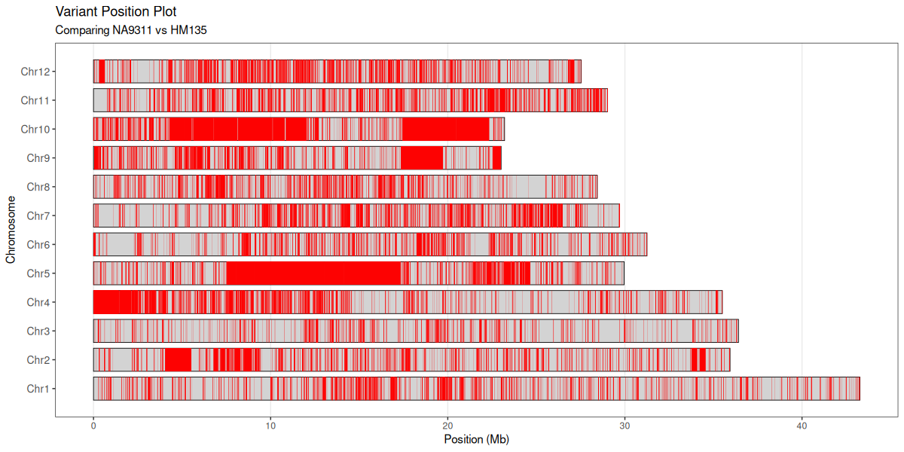

# VCF Variant Position Difference Plot

An R script project for plotting variant positions from VCF files, comparing genotypes between two samples.

## Overview

This tool reads a tab-delimited file converted from VCF format and creates visualizations showing variant positions across chromosomes. It compares genotypes between a baseline sample and a comparison sample, highlighting positions where they differ.

## Prerequisites

- R (version 3.6 or higher)
- R packages:
  - `ggplot2`
  - `optparse`
  - `CMplot` (optional, only required when `--CMplot` is used)
- GATK (for converting VCF to tab-delimited format)

## Installation

Install required R packages:

```r
install.packages(c("ggplot2", "optparse"))
# Optional: for CMplot mode
install.packages("CMplot")
```

## Workflow

### Step 1: Convert VCF to Tab-Delimited Format

Use GATK's VariantsToTable to convert your VCF file to a tab-delimited format:

```bash
gatk VariantsToTable \
   -V input.vcf \
   -F CHROM -F POS -GF GT \
   -O output.table
```

This command extracts:
- `CHROM`: Chromosome name
- `POS`: Position
- `GT`: Genotype for each sample (creates columns like `sampleID.GT`)

### Step 2: Plot Variant Positions

Run the R script to generate the plot:

```bash
Rscript vcf_difplot.R -i output.table -b baseline_sample -c comparison_sample -o variant_plot.pdf
```

## Usage

```bash
Rscript vcf_difplot.R [options]
```

### Required Arguments

- `-i, --input FILE`: Input tab-delimited file (required)

### Sample Selection (choose one method for each)

**Baseline Sample:**
- `-b, --basename NAME`: Baseline sample name
- `-B, --basecol INT`: Baseline sample column position (1-based)

**Comparison Sample:**
- `-c, --copname NAME`: Comparison sample name
- `-C, --copcol INT`: Comparison sample column position (1-based)

### Optional Arguments

- `-o, --output FILE`: Output plot file (default: `variant_plot.pdf`)
- `-l, --chrlength FILE`: Chromosome length file (CHROM LENGTH)
  - If not provided, uses maximum variant position (warning will be issued)
  - Separator is automatically detected (supports tab, comma, semicolon, or whitespace)
- `-u, --unit NUM`: Chromosome length unit (default: 1e6 for Mb)
- `-t, --threads INT`: Number of threads for parallel processing by chromosome (default: 1)
  - Use `-t 12` to enable parallel processing with 12 threads for faster execution
  - Recommended for large datasets with many positions
- `--baseHetcheck`: Check if baseline sample is homozygous; ignore heterozygous positions
  - Only positions where baseline is homozygous (e.g., A/A, G|G) will be included
- `--copHetcheck`: Check if comparison sample is homozygous; ignore heterozygous positions
  - Only positions where comparison is homozygous (e.g., A/A, G|G) will be included
- `--output_table FILE`: Write the final variant positions used for plotting to a tab-delimited file (columns: CHROM, POS)
- `--exclude_chr CHROMS`: Comma-separated list of chromosome names to exclude from display (e.g. `ChrUn,ChrM`)
  - Chromosomes are matched exactly against the CHROM column in the input data
  - Excluded chromosomes are removed from all plots and analyses

### CMplot Mode

- `--CMplot`: Use the [CMplot](https://github.com/YinLiLin/CMplot) R package to draw a density plot instead of ggplot2
  - CMplot must be installed: `install.packages("CMplot")`
  - When enabled, the output file name and format are controlled by `-o` (e.g., `-o output.jpg`)
- `--CMplot_bin_size NUM`: Genomic window size in bp for density calculation (default: `1e6`)
- `--CMplot_col COLORS`: Comma-separated color names for the density gradient, from low to high density (default: `darkgreen,yellow,red`)
- `--CMplot_dpi INT`: Resolution for raster output files (default: `300`)
- `--CMplot_width NUM`: Plot width in inches (default: `9`)
- `--CMplot_height NUM`: Plot height in inches (default: `6`)
- `--CMplot_main TITLE`: Title displayed on the density plot (default: `Variant Density Plot`)

### Visualization Customization

- `--segmentColor COLOR`: Color for variant position segments (default: `red`)
  - Accepts any valid R color name or hex code (e.g., "blue", "#FF5733")
- `--segmentSize NUM`: Thickness of variant position segments (default: `0.5`)
- `--chrBorderColor COLOR`: Color for chromosome borders (default: `black`)
  - Accepts any valid R color name or hex code
- `--chrBorderSize NUM`: Thickness of chromosome borders (default: `0.3`)

### Genotype Handling

The script properly handles GATK VariantsToTable genotype formats:
- Supports both `/` and `|` as separators (phased and unphased)
- Treats `A/T` and `T|A` as equivalent (normalizes for comparison)
- Automatically filters out positions with missing data (`./.`) or wildcards (`*/*`)
- Can optionally filter for homozygous positions only
- **Smart chromosome sorting**: Chromosomes are sorted in natural numerical order (Chr1, Chr2, ..., Chr10, Chr11) instead of alphabetical order

## Example

The following command shows all available parameters. Parameters marked with `# optional` can be omitted; the rest are required.

```bash
Rscript vcf_difplot.R \
  -i variants.table \          # required: input tab-delimited file
  -b sample1 \                 # required: baseline sample name (or use -B for column index)
  -c sample2 \                 # required: comparison sample name (or use -C for column index)
  -o comparison.pdf \          # optional: output plot file (default: variant_plot.pdf)
  -l chr_lengths.txt \         # optional: chromosome length file; auto-detected from data if omitted
  -u 1000000 \                 # optional: position unit divisor, e.g. 1e6 = Mb (default: 1e6)
  -t 4 \                       # optional: threads for parallel processing (default: 1)
  --baseHetcheck \             # optional: skip heterozygous positions in baseline sample
  --copHetcheck \              # optional: skip heterozygous positions in comparison sample
  --segmentColor red \         # optional: color for variant segments (default: red)
  --segmentSize 0.5 \          # optional: thickness of variant segments (default: 0.5)
  --chrBorderColor black \     # optional: color for chromosome borders (default: black)
  --chrBorderSize 0.3 \        # optional: thickness of chromosome borders (default: 0.3)
  --output_table positions.tsv # optional: write final variant positions (CHROM + POS) to this file
```

To use CMplot for density plotting instead of ggplot2:

```bash
Rscript vcf_difplot.R \
  -i variants.table \
  -b sample1 \
  -c sample2 \
  -o comparison.jpg \          # output format is derived from the extension (pdf/png/jpg)
  --CMplot \                   # enable CMplot density plot mode
  --CMplot_bin_size 1e6 \      # optional: genomic window size in bp (default: 1e6)
  --CMplot_col "darkgreen,yellow,red" \  # optional: density color gradient
  --CMplot_dpi 300 \           # optional: resolution for raster output (default: 300)
  --CMplot_width 9 \           # optional: plot width in inches (default: 9)
  --CMplot_height 6 \          # optional: plot height in inches (default: 6)
  --CMplot_main "My Title"     # optional: plot title
```

> **Note on sample selection:** For each sample (baseline and comparison) you must use either the
> name flag (`-b`/`-c`) or the 1-based column-index flag (`-B`/`-C`). If both are given for the
> same sample, the name takes precedence.

### Chromosome Length File Format

The chromosome length file should have two columns (no header). The separator is automatically detected (tab, comma, semicolon, or whitespace):

**Tab-delimited:**
```
chr1	248956422
chr2	242193529
chr3	198295559
...
```

**Comma-delimited:**
```
chr1,248956422
chr2,242193529
chr3,198295559
```

**Space-delimited:**
```
chr1 248956422
chr2 242193529
chr3 198295559
```

The script will automatically detect and use the appropriate separator.

## Output

The script generates a plot where:
- Each chromosome is represented as a horizontal rectangle (light gray by default)
- Variant positions (where genotypes differ) are shown as vertical lines (red by default)
- The x-axis shows position (scaled by the specified unit)
- The y-axis lists chromosomes

Additionally, the script prints to the console:
- Summary statistics (total positions, variant positions, non-variant positions)
- **First 20 variant positions** (where baseline and comparison genotypes differ), showing:
  - CHROM: Chromosome name
  - POS: Position
  - Baseline_GT: Genotype of baseline sample
  - Comparison_GT: Genotype of comparison sample
- Chromosome information and processing details
- 

## Features

- **Automatic Sample Detection**: Reads GT column names to identify available samples
- **Flexible Sample Selection**: Specify samples by name or column position
- **Chromosome Length Handling**: Supports custom length files or auto-detects from data
- **Multiple Output Formats**: Supports PDF, PNG, and JPEG
- **Robust Error Handling**: Validates input files, parameters, and data structure
- **Informative Messages**: Provides detailed progress and summary information

## Error Handling

The script includes comprehensive error checking for:
- Missing or inaccessible input files
- Missing required columns (CHROM, POS, GT)
- Invalid sample names or column positions
- Missing chromosome length data
- Invalid file formats

## Notes

- GT columns must be named in the format `sampleID.GT`
- Missing genotypes are automatically excluded from comparison
- Chromosomes are sorted numerically when possible, alphabetically otherwise
- The plot height automatically adjusts based on the number of chromosomes

## License

This project is open source and available for use and modification.

## Contributing

Contributions are welcome! Please feel free to submit issues or pull requests.
