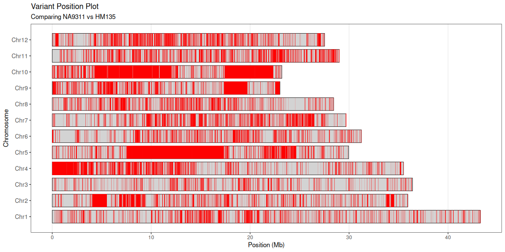

# vcf-DifPlot

一个用于绘制 VCF 变异位点差异图的 R 脚本工具。读取 GATK `VariantsToTable` 输出的制表符分隔文件，比较两个样本的基因型，在染色体级别可视化基因型存在差异的位置。

## 功能概览

- 比较两个样本（baseline vs comparison）的基因型差异
- 染色体级别的变异位点可视化（矩形 + 垂直线段）
- 支持 PDF / PNG / JPEG / SVG 输出
- 可选生成 CMplot SNP 密度图（`--cmplot`）
- 支持纯合子过滤、单倍体/多倍体基因型
- 交互式参数引导模式（`-I`）
- 染色体自然排序（Chr1, Chr2, ..., Chr10, X, Y, MT），Chr1 在最上方

## 安装

### 依赖

- R >= 3.6
- R 包：
  - `ggplot2` (>= 3.4.0)
  - `optparse`
  - `data.table`
  - `CMplot`（仅在使用 `--cmplot` 时需要）
  - `R.utils`（仅在读取 gzip 压缩输入时需要）
- GATK（用于将 VCF 转换为制表符分隔格式）

### 安装 R 包

```r
install.packages(c("ggplot2", "optparse", "data.table"))
# 可选
install.packages("CMplot")   # 用于 --cmplot 密度图
install.packages("R.utils")  # 用于读取 .gz 输入
```

## 工作流程

### 第 1 步：将 VCF 转换为制表符格式

```bash
gatk VariantsToTable \
   -V input.vcf \
   -F CHROM -F POS -GF GT \
   -O output.table
```

生成的文件包含：
- `CHROM`：染色体名
- `POS`：位置
- `sampleID.GT`：每个样本的基因型列（如 `sample1.GT`、`sample2.GT`）

### 第 2 步：绘制变异位点图

```bash
Rscript vcf_difplot.R -i output.table -b sample1 -c sample2 -o variant_plot.pdf
```

## 参数完整说明

### 基本参数

| 参数 | 类型 | 默认值 | 说明 |
|------|------|--------|------|
| `-i, --input` | FILE | （必填） | 输入的制表符分隔文件（GATK VariantsToTable 输出） |
| `-o, --output` | FILE | `variant_plot.pdf` | 输出图文件。支持 pdf / png / jpg / svg，格式由扩展名决定 |
| `-I, --interactive` | 开关 | 关闭 | 交互式模式：逐项提示输入参数（忽略其他所有命令行参数） |

### 样本选择

每个样本（baseline 和 comparison）必须用**名称**或**列索引**二选一指定。若两者都提供，名称优先。

| 参数 | 类型 | 说明 |
|------|------|------|
| `-b, --basename` | NAME | 基线样本名（对应列头，如 `sample1`） |
| `-B, --basecol` | INT | 基线样本的 GT 列索引（1-based，**仅在 GT 列中计数**） |
| `-c, --copname` | NAME | 比对样本名 |
| `-C, --copcol` | INT | 比对样本的 GT 列索引（1-based，仅在 GT 列中计数） |

> **列索引说明**：索引只统计 GT 列，不统计 CHROM/POS。例如文件列为 `CHROM POS s1.GT s2.GT s3.GT` 时，`-B 1` 选择 `s1.GT`，`-B 2` 选择 `s2.GT`。

### 染色体与坐标

| 参数 | 类型 | 默认值 | 说明 |
|------|------|--------|------|
| `-l, --chrlength` | FILE | 自动检测 | 染色体长度文件。取前两列（CHROM, LENGTH），支持 samtools `.fai`（5 列）。分隔符自动识别（tab/逗号/分号/空格）。不提供时用每条染色体的最大观测位置 |
| `-u, --unit` | NUM | `1e6` | 位置单位除数。`1e6`=Mb，`1e3`=kb，`1`=bp |

### 基因型过滤

| 参数 | 类型 | 默认值 | 说明 |
|------|------|--------|------|
| `--baseHetcheck` | 开关 | 关闭 | 仅保留基线样本为纯合子的位点（忽略杂合位点） |
| `--copHetcheck` | 开关 | 关闭 | 仅保留比对样本为纯合子的位点 |

### 主图样式

| 参数 | 类型 | 默认值 | 说明 |
|------|------|--------|------|
| `--segmentColor` | COLOR | `red` | 变异位点线段颜色（R 颜色名或 hex，如 `#FF5733`） |
| `--segmentSize` | NUM | `0.5` | 变异位点线段粗细 |
| `--segmentAlpha` | NUM | `0.6` | 变异位点线段透明度（0-1，0 全透明，1 不透明） |
| `--chrBorderColor` | COLOR | `black` | 染色体矩形边框颜色 |
| `--chrBorderSize` | NUM | `0.3` | 染色体矩形边框粗细 |

所有颜色参数接受大小写不敏感的 R 颜色名（如 `red`、`DarkBlue`）或 hex 代码。

### 输出表格

| 参数 | 类型 | 默认值 | 说明 |
|------|------|--------|------|
| `--output_table` | FILE | 无 | 将用于绘图的变异位点（CHROM, POS 两列）写入制表符文件，按基因组坐标排序 |

### CMplot SNP 密度图

启用 `--cmplot` 后，除主图外额外生成一张 CMplot SNP 密度图，输出到主图同目录，文件名为 `Marker_Density.<主图名>_density.<ext>`。

| 参数 | 类型 | 默认值 | 说明 |
|------|------|--------|------|
| `--cmplot` | 开关 | 关闭 | 启用 CMplot SNP 密度图输出（需要 CMplot 包） |
| `--cmplot_bin_size` | NUM | `1e6` | 密度计算窗口大小（bp） |
| `--cmplot_den_col` | COLORS | `darkgreen,yellow,red` | 密度渐变色，逗号分隔（低→高） |
| `--cmplot_dpi` | INT | `300` | 密度图输出分辨率 |
| `--cmplot_width` | NUM | 自动 | 密度图宽度（英寸） |
| `--cmplot_height` | NUM | 自动 | 密度图高度（英寸） |
| `--cmplot_main` | TEXT | 自动生成 | 密度图标题（默认为 "SNP Density: base vs comp"） |

## 完整示例

```bash
Rscript vcf_difplot.R \
  -i variants.table \
  -b sample1 \
  -c sample2 \
  -o comparison.pdf \
  -l chr_lengths.txt \
  -u 1000000 \
  --baseHetcheck \
  --copHetcheck \
  --segmentColor red \
  --segmentSize 0.5 \
  --segmentAlpha 0.6 \
  --chrBorderColor black \
  --chrBorderSize 0.3 \
  --output_table positions.tsv \
  --cmplot \
  --cmplot_bin_size 1000000 \
  --cmplot_den_col darkgreen,yellow,red \
  --cmplot_dpi 300
```

## 交互式模式

```bash
Rscript vcf_difplot.R -I
```

交互式模式会逐项提示输入每个参数，必填项循环直到输入有效值，可选项按回车使用默认值。结束后会打印等价的非交互命令，方便下次直接复用。

在 Unix + bash + TTY 环境下支持 Tab 文件补全和方向键历史；其他环境（Windows、管道、CI）自动降级为普通行读取。

## 基因型处理规则

- 支持 `/` 和 `|` 分隔符（phased 和 unphased）
- `A/T` 与 `T|A` 视为等价（等位基因排序后比较）
- 自动过滤缺失数据（`./.`）、通配符（`*/*`）和畸形基因型（空等位基因、连续分隔符）
- **单倍体支持**：单等位基因型（如男性 chrX 的 `A`）扩展为纯合二倍体（`A/A`）后比较
- **多倍体支持**：3+ 等位基因型按等位基因集合排序后比较
- 染色体按基因组自然顺序排序（数字 → X → Y → MT → 其他）
- Y 轴反转，Chr1 显示在最上方（符合基因组浏览器习惯）

## 染色体长度文件格式

取前两列（CHROM, LENGTH），多余列忽略，因此 samtools `.fai` 可直接使用。分隔符自动识别。

**制表符分隔：**
```
chr1	248956422
chr2	242193529
```

**samtools .fai（5 列，仅前两列被使用）：**
```
chr1	248956422	112	80	81
chr2	242193529	252092603	80	81
```

**逗号分隔：**
```
chr1,248956422
chr2,242193529
```

## 输出说明

主图中：
- 每条染色体为一个水平矩形（浅灰填充）
- 基因型差异位点为垂直线段（默认红色）
- X 轴为位置（按 `--unit` 缩放）
- Y 轴为染色体（Chr1 在顶部）

控制台输出：
- 汇总统计（总位点数、变异数、非变异数）
- 前 20 个变异位点及其基因型
- 染色体长度信息
- 数据问题警告（位点超出染色体长度、单倍体/多倍体、重复染色体等）

启用 `--cmplot` 时额外输出 SNP 密度图。



## 错误校验

脚本在读取数据前即完成全部参数校验，快速失败：
- ggplot2 版本检查（启动时）
- 输出格式校验（读数据前）
- 颜色与数值参数校验
- 输入文件存在性与列结构检查
- 样本名/索引解析（附清晰错误信息）
- 同一样本检测（baseline == comparison 时报错停止）
- 染色体长度文件校验（重复项、非数字、表头自动跳过）
- POS 溢出检测（变异超出染色体长度时警告）

## 注意事项

- GT 列必须命名为 `sampleID.GT` 格式
- 缺失和畸形基因型自动排除
- 图高度根据染色体数量自动调整
- gzip 输入（.gz / .bgz）需要 `R.utils` 包
- CMplot 密度图文件名固定为 `Marker_Density.<名称>.<ext>` 格式（CMplot 包命名规则）

## License

开源项目，可自由使用和修改。

## Contributing

欢迎提交 Issue 和 Pull Request。
